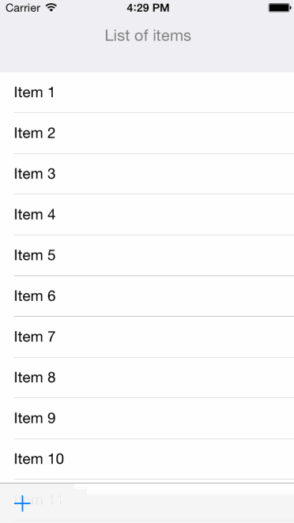

# AFSwipeToHide

A simple utility class to help achieve Safari's swipe-to-hide effect.

This class provides all the logic for creating the effect, but is completely decoupled from UI classes so it integrates cleanly with existing code. It can be easily used as a `UIScrollViewDelegate` or on its own. Check out
the [example project](https://github.com/appfigures/AFSwipeToHide/blob/master/Example/AFSwipeToHide/ViewController.m) for simple usage (shown in the animation below).

Works with iOS 5.0+

## Installation

AFSwipeToHide is available through [CocoaPods](http://cocoapods.org). To install
it, simply add the following line to your Podfile:

    pod "AFSwipeToHide"

## Author

[@oztune](http://twitter.com/oztune) from [@appFigures](http://twitter.com/appFigures)

## License

AFSwipeToHide is available under the MIT license. See the LICENSE file for more info.

